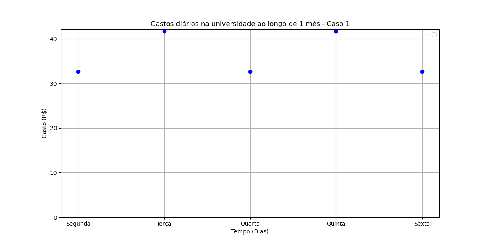

## Gastos diários na universidade ao longo de 1 mês:

-  Caso 1:  
  

```
The simple plot describes a discret function. Where x values belongs to **Z** (Integers) representing week days and the y values represents the expenses in a week.
```
Context:

We got two constant functions inside the major:  
E(x) = 32.70: Represents expenses in 3 days a week.
H(x) = 41.80: Represents expenses in 2 days a week.
